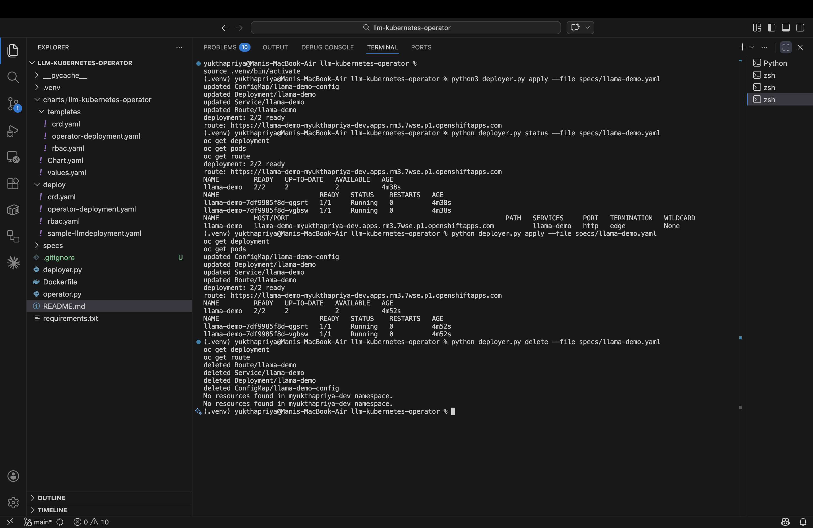

# LLM Kubernetes Operator

A Kubernetes/OpenShift Operator for declaratively deploying and managing LLM inference workloads using a custom resource.

## Features

- `LLMDeployment` custom resource
- Reconciliation into:
  - `Deployment`
  - `Service`
  - `ConfigMap`
  - OpenShift `Route` (when available)
- Status updates:
  - phase
  - ready replicas
  - service URL
  - route host / external URL
- Helm chart included

## Custom Resource Example

```yaml
apiVersion: ai.redhat.example.com/v1alpha1
kind: LLMDeployment
metadata:
  name: llama-demo
spec:
  modelName: mistralai/Mistral-7B-Instruct-v0.2
  image: ghcr.io/rh-aiservices-bu/vllm-cpu:latest
  replicas: 1
  port: 8000
  routingPolicy: round_robin
  maxConcurrency: 8
  tensorParallelism: 1
  route:
    enabled: true
  env:
    HF_MODEL_ID: mistralai/Mistral-7B-Instruct-v0.2
    VLLM_PORT: "8000"
  resources:
    requests:
      cpu: "500m"
      memory: "1Gi"
    limits:
      cpu: "1"
      memory: "2Gi"
```

## Local Development

### Install dependencies
```bash
python3.11 -m venv .venv
source .venv/bin/activate
pip install -r requirements.txt
```

### Run locally against your kubeconfig
```bash
kopf run --standalone operator.py
```

## Deploy to Kubernetes / OpenShift

### Apply CRD and RBAC
```bash
kubectl apply -f deploy/crd.yaml
kubectl apply -f deploy/rbac.yaml
```

### Build and push operator image
```bash
docker build -t your-dockerhub-user/llm-kubernetes-operator:latest .
docker push your-dockerhub-user/llm-kubernetes-operator:latest
```

Update `deploy/operator-deployment.yaml` with your image, then:

```bash
kubectl apply -f deploy/operator-deployment.yaml
```

### Create sample custom resource
```bash
kubectl apply -f deploy/sample-llmdeployment.yaml
```

## Inspect resources

```bash
kubectl get llmdeployments
kubectl describe llmdeployment llama-demo
kubectl get deployment,service,configmap
```

On OpenShift:

```bash
oc get route
```
## Demo Screenshot

The screenshot below shows the end-to-end lifecycle of the OpenShift inference control-plane prototype, including resource apply/update, status inspection, successful OpenShift Route exposure, and cleanup.


## Helm install

```bash
helm install llm-kubernetes-operator ./charts/llm-kubernetes-operator
```

## Notes

- OpenShift `Route` creation is attempted only if the Route API is available.
- On plain Kubernetes, the operator still works and simply skips Route creation.
- For free OpenShift Sandbox environments, this project is best used to validate operator lifecycle and OpenShift-native deployment workflows rather than high-performance GPU-backed inference.
